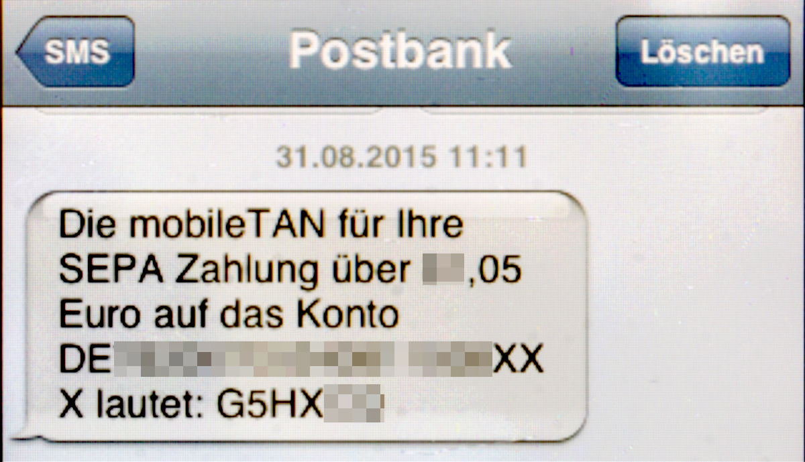

Giữa đêm, app ngân hàng trên điện thoại rung lên một nhịp chói: thẻ của bạn vừa bị trừ gần 2 triệu đồng vào một trang web lạ ở nước ngoài. Bạn giật mình ngồi dậy, lật lại điện thoại — không có mã OTP nào được gửi về máy, không hề có tin nhắn xác minh nào cả. Làm sao một giao dịch có thể diễn ra *mà không cần người chủ thẻ xác nhận*? Câu trả lời không nằm ở một lỗ hổng đơn lẻ, mà nằm ngay trong cách ngành thanh toán thẻ quốc tế được thiết kế — một hệ thống mang tên **3D Secure (EMV 3DS)**.

## Hiểu nhầm phổ biến: "Có thẻ là luôn phải nhập OTP"

Nhiều người hiểu cơ chế xác thực thẻ như một chiếc nút gác cổng cố định: muốn trừ tiền thì phải bấm nút. Thực tế phức tạp hơn nhiều. 3D Secure — mà Visa gọi là **Visa Secure**, Mastercard gọi là **Identity Check**, Amex gọi là **SafeKey** — là một giao thức do tổ chức EMVCo phát hành nhằm thêm **một lớp xác thực của ngân hàng phát hành** vào các giao dịch Card-Not-Present (mua online, không quẹt thẻ vật lý).

Ở phiên bản 3D Secure 1.0, mỗi lần thanh toán bạn thường bị "chuyển hướng" sang một trang nhập mật khẩu tĩnh. Phiên bản 2.0 (ra mắt từ năm 2019–2021) thay đổi triệt để: thay vì xác thực mỗi lần, hệ thống **trò chuyện ngầm** với ngân hàng phát hành của bạn, gửi lên hàng chục tín hiệu về giao dịch, rồi để ngân hàng tự quyết định — gọi OTP, hỏi vân tay, hay đơn giản là bỏ qua.

*Ảnh: Wikimedia Commons — mã OTP Mobile TAN trên smartphone (public domain).*

## Bộ não đánh giá rủi ro: Risk-Based Authentication

Điểm mấu chốt của 3D Secure 2.0 nằm ở khái niệm **Risk-Based Authentication (RBA)** — ngân hàng phát hành không còn "bật hay tắt xác thực", mà **tính toán rủi ro trong vài chục mili-giây** dựa trên dữ liệu giao dịch do merchant và ngân hàng thanh toán gửi lên:

- Thiết bị, trình duyệt, địa chỉ IP có quen thuộc với lịch sử chi tiêu không.
- Giờ giấc, vị trí địa lý có khớp với thói quen của chủ thẻ không.
- Giá trị giao dịch nằm trong mức chi tiêu bình thường hay không.
- Tần suất mua, số lượng merchant, dấu hiệu mua liên tục trong thời gian ngắn.
- Độ uy tín và lịch sử gian lận của chính merchant đó.

Kết quả phân tích sẽ rẽ giao dịch vào **một trong hai con đường**:


flowchart TD
    A[Mua hàng online bằng thẻ Visa/Mastercard] --> B{Giao dịch có 3D Secure?}
    B -- Không --> C[Duyệt như giao dịch thường, Merchant chịu rủi ro]
    B -- Có --> D{Bộ máy đánh giá rủi ro Risk-Based Authentication}
    D -- Rủi ro thấp --> E[Frictionless Flow, duyệt ngầm không cần OTP]
    D -- Rủi ro cao --> F[Challenge Flow, ép OTP hoặc sinh trắc học]
    F --> G[Xác thực thành công, giao dịch được duyệt]
    F --> H[Nghi ngờ gian lận, ngân hàng từ chối giao dịch]


### Frictionless Flow — con đường êm ái

Khi các tín hiệu rủi ro đều "xanh", ngân hàng phát hành trả lời giao dịch bằng một xác nhận ngầm: *hợp lệ, không cần hỏi thêm một câu nào*. Người mua thấy giao dịch hoàn tất trong chớp mắt, không hề biết có một cuộc "hỏi han" giữa các ngân hàng ở hậu trường. Đây là thiết kế cố ý — rút ngắn thao tác thanh toán để tăng tỷ lệ chốt đơn, một ưu tiên sống còn với các sàn thương mại điện tử.

### Challenge Flow — con đường còn cản trở

Ngược lại, khi có dấu hiệu bất thường (thiết bị lạ, IP lạ, số tiền lớn, tần suất dồn dập), ngân hàng sẽ *tự chặn tay ly* và đẩy giao dịch vào vòng xác thực thật sự: gửi OTP về số điện thoại đăng ký, yêu cầu vân tay/khuôn mặt trong app, hoặc xác minh bằng mật khẩu. Nếu không vượt qua được, giao dịch bị từ chối.

| Tiêu chí | Frictionless Flow | Challenge Flow |
|---|---|---|
| Ngưỡng rủi ro | Thấp | Cao |
| OTP / sinh trắc học | Không cần | Bắt buộc |
| Tốc độ | Tức thì, không gián đoạn | Thêm một bước xác minh |
| Cảm nhận của người mua | Mượt, gần như không thấy bước xác thực | Thấy rõ màn hình xác minh của ngân hàng |
| Bản chất bảo mật | Ngân hàng tự tin dựa trên dữ liệu | Cần bằng chứng xác thực mạnh |

## Toàn cảnh cuộc "bắt tay" giữa các ngân hàng

Để hình dung chuyện gì xảy ra trong khoảng thời gian bạn bấm nút "Thanh toán", hãy nhìn vào luồng giao dịch đầy đủ với bốn bên: website bán hàng (merchant), ngân hàng thanh toán (acquirer), mạng thẻ và ngân hàng phát hành (issuer):


sequenceDiagram
    autonumber
    participant U as Người mua
    participant M as Website Merchant
    participant A as Ngân hàng thanh toán Acquirer
    participant S as Mạng thẻ Visa Mastercard
    participant I as Ngân hàng phát hành Issuer
    U->>M: Nhập thông tin thẻ và chọn thanh toán
    M->>A: Gửi giao dịch kèm dữ liệu rủi ro
    A->>S: Chuyển giao dịch và yêu cầu xác minh 3DS
    S->>I: Hỏi ngân hàng phát hành có cần xác thực không
    I-->>S: Frictionless duyệt ngầm nếu rủi ro thấp
    I-->>S: Challenge yêu cầu OTP hoặc sinh trắc học
    S-->>A: Trả kết quả xác minh 3DS
    A-->>M: Duyệt hoặc từ chối giao dịch


## Ba lý do khiến thẻ "mất tiền" mà không có OTP

Giờ là lúc trả lời câu hỏi đau nhất: **vì sao kẻ gian cướp được tiền mà bạn không hề nhận OTP?** Có ba kịch bản, độc lập nhưng có thể diễn ra cùng lúc.

### Kịch bản 1 — Trang web không tham gia 3D Secure

Không phải merchant nào cũng bật 3D Secure. Nhiều ông lớn thanh toán và thương mại điện tử — thường được nhắc tới như Amazon, Uber hay các nền tảng quảng cáo — ưu tiên trải nghiệm checkout mượt, và chấp nhận trả phí cao hơn hoặc tự chịu rủi ro để *bỏ qua* bước xác thực của ngân hàng. Với những merchant này, giao dịch đi **thẳng** từ website đến ngân hàng thanh toán và được trừ tiền mà không hề hỏi ngân hàng phát hành của bạn một câu nào.

*Ảnh: Bogdan Hoyaux / European Commission, CC BY 4.0 (Wikimedia Commons).*

Kẻ gian chỉ cần "rót" thông tin thẻ của bạn — lấy từ một vụ lộ dữ liệu, một trang phishing, hay một máy ATM bị gắn skimmer — vào các merchant loại này. Không có 3D Secure đồng nghĩa không có màn hình OTP, và ngân hàng phát hành chỉ biết chuyện khi tiền đã đi.

### Kịch bản 2 — Trừ tiền định kỳ (Merchant-Initiated Transaction)

Đây là cái bẫy thầm lặng nhất. Khi bạn từng mua một lần và đồng ý lưu thẻ để gia hạn — Netflix, Spotify, Google Play, ứng dụng lưu trữ hay thậm chí những gói "dùng thử" — bạn đã ký một "ủy quyền ngầm". Những lần trừ tiền về sau thuộc loại **Merchant-Initiated Transaction (MIT)**: do merchant khởi tạo dựa trên **token hoặc tham chiếu giao dịch đã được xác thực từ lần đầu**, nên về mặt kỹ thuật chúng *không cần* hỏi lại OTP lần nào nữa.

Hệ lụy: kẻ gian không cần đánh cắp OTP. Chỉ cần chiếm được tài khoản của bạn trên một dịch vụ đã lưu sẵn thẻ (qua mật khẩu yếu hoặc lừa đảo), chúng nhấn "nâng cấp gói", "mua thêm" và tiền cứ thế bị khấu trừ trong im lặng — mỗi giao dịch trông giống một khoản phí định kỳ vô hại.

### Kịch bản 3 — Lọt lưới bộ máy đánh giá rủi ro (Frictionless Spoofing)

Ngay cả khi giao dịch *có* chạy qua 3D Secure, kẻ gian vẫn có thể "dạy" bộ máy AI của ngân hàng tin rằng chúng là chính bạn. Kỹ thuật gọi là **Frictionless Spoofing**: bọn gian giả lập hành vi, làm quen dần địa chỉ IP, dùng trình duyệt và thiết bị "sạch sẻ", chọn thời điểm giờ giấc giống thói quen của chủ thẻ, rồi thăm dò bằng những giao dịch nhỏ để "huấn luyện" ngưỡng rủi ro. Đến lúc bộ máy đã "thuần", một giao dịch lớn bất ngờ sẽ được duyệt ngầm theo lối Frictionless — và bạn lại trắng đôi mắt nhìn tiền biến mất mà không một mã OTP nào được gửi về máy.

*Ảnh: Shixart1985, CC BY 2.0 (Wikimedia Commons).*

| Kịch bản | Cơ chế | Vì sao không có OTP | Mức độ phổ biến |
|---|---|---|---|
| Merchant không 3D Secure | Giao dịch đi thẳng, không qua bước xác minh | Không tồn tại lớp xác thực | Rất phổ biến |
| Trừ tiền định kỳ | Merchant khởi tạo, thẻ đã lưu từ trước | Đã xác thực lần đầu, các lần sau được miễn | Phổ biến |
| Frictionless spoofing | Kẻ gian "nhiễu" bộ máy rủi ro | Bị xếp nhầm vào nhóm rủi ro thấp | Ít hơn, nhưng nguy hiểm nhất |

## Ai phải bồi thường? — Quy tắc Liability Shift

Nhiều người nghĩ: ngân hàng phát hành chịu trách nhiệm là chắc. Quy tắc thực tế của mạng thẻ là **Liability Shift** — trách nhiệm thanh toán rủi ro **dịch chuyển** tùy theo việc giao dịch có xác thực 3D Secure hay không:

| Trường hợp tranh chấp | Ai gánh rủi ro gian lận | Lý do |
|---|---|---|
| Giao dịch **có** 3D Secure | Ngân hàng phát hành | Giao dịch đã qua xác thực nên khó đổ cho merchant |
| Giao dịch **không** 3D Secure | Merchant | Merchant chủ động bỏ lớp bảo vệ nên phải bồi hoàn |

Về mặt kỹ thuật, quy định này là công cụ *ép* merchant nên bật 3D Secure: nếu họ không bật mà để xảy ra chargeback (khiếu nại của chủ thẻ), họ phải tự bỏ tiền bồi hoàn. Nhưng trên thực tế, **quyền lợi của bạn không vì thế mà tự động được bảo vệ** — mastercard và visa quy định *zero liability* (thẻ tiêu dùng thường được miễn trách) gần như chỉ áp dụng khi bạn **không lộ mã PIN/CVV và báo mất thẻ kịp thời**. Nền tảng bồi hoàn mạnh nhất của bạn vẫn là báo tra soát nhanh, đúng quy trình.

> **Nguyên tắc vàng:** mã OTP chỉ là một lớp "kèo", không phải tấm khiên duy nhất. An toàn thẻ đến từ việc kiểm soát *mặt tiền*: hạn mức, kênh thanh toán, và sự cảnh giác với những "lần đầu" mua hàng.

## Cách bảo vệ tài khoản ngay từ hôm nay

Dưới đây là các thao tác bạn có thể làm ngay trên app ngân hàng, không cần kiến thức kỹ thuật:

1. **Bật/tắt kênh thanh toán online (CNP) theo nhu cầu.** Hầu hết app ngân hàng Việt Nam trong mục quản lý thẻ cho phép khóa/mở *thanh toán trực tuyến (Card-Not-Present)*. Khi không có nhu cầu mua online, hãy tắt kênh này — kẻ gian sẽ không thể trừ được dù có đủ thông tin thẻ.
2. **Hạ hạn mức giao dịch online xuống mức tối thiểu cần dùng.** Thay vì để hạn mức hàng chục triệu, chỉ đặt mức vừa đủ cho nhu cầu thực tế của bạn trong ngày.
3. **Khóa thẻ trong app thật nhanh.** Thanh toán online thường trừ tiền ngay khi nhập số thẻ. Khi phát hiện giao dịch lạ, việc đầu tiên là khóa thẻ trong app, sau đó mới gọi điện tra soát.
4. **Cạo/số hóa mã CVV thay vì nhìn thấy thường trực.** Ba chữ số mặt sau là "chìa khóa" cho các giao dịch CNP; việc cạo rồi nhớ số (hoặc lưu trong trình quản lý mật khẩu) giúp những vụ chụp ảnh thẻ, rò rỉ dữ liệu mất đi hiệu lực.
5. **Dùng thẻ ảo / thẻ phụ với hạn mức nhỏ** cho các website lạ, mua hàng nước ngoài hay đăng ký dùng thử — thẻ chính luôn giữ hạn mức lớn cho nhu cầu lớn.
6. **Bật thông báo mọi giao dịch và đề phòng phishing.** Gõ lại địa chỉ thật của ngân hàng thay vì bấm link trong email/Zalo/SMS; tuyệt đối không nhập OTP, mã CVV vào bất kỳ trang nào không phải cổng thanh toán chính thức.
7. **Rà soát các khoản trừ định kỳ.** Vào mục "Quản lý đăng ký/gia hạn" ở các dịch vụ như Google Play, App Store... để phát hiện những gói bạn đã quên — và cả những gói mà bạn chưa từng đăng ký.

## Kết luận: đừng tin duy nhất vào OTP

3D Secure 2.0 là một bước tiến lớn về bảo mật ngành thẻ — nó cho phép ngân hàng *lọc rủi ro thông minh* thay vì gõ cửa hỏi bạn mỗi lần. Nhưng chính cơ chế êm ái ấy lại tạo ra ảo giác: *"không OTP nghĩa là không có gì bất thường"*. Thực tế cho thấy, một giao dịch đang chạy lặng lẽ theo con đường Frictionless cũng có thể là kết quả của việc thẻ bạn đã bị lộ, một hợp đồng định kỳ bị lạm dụng, hay một kẻ trộm đang "thuần hóa" thuật toán ngân hàng.

Vì vậy, hãy coi OTP là một trong những lớp bảo vệ, không phải là *chốt chặn cuối cùng*. Xây dựng thói quen: khóa kênh thanh toán online khi không dùng, hạ hạn mức, dùng thẻ phụ cho những bối cảnh rủi ro cao, và luôn xử lý ngay lập tức khi giao dịch lạ xuất hiện. Bảo mật tài chính, giống như mọi kỹ năng khác, là thứ bạn **học mỗi ngày** — và blog này sinh ra chính vì điều đó. Nếu bạn muốn tìm hiểu thêm một tài liệu quan trọng khác trong giao dịch di chuyển, hãy đọc [bài viết về PNR trên vé máy bay](/posts/pnr-la-gi-va-vi-sao-tren-ve-may-bay-luon-co-ma-6-ky-tu/).