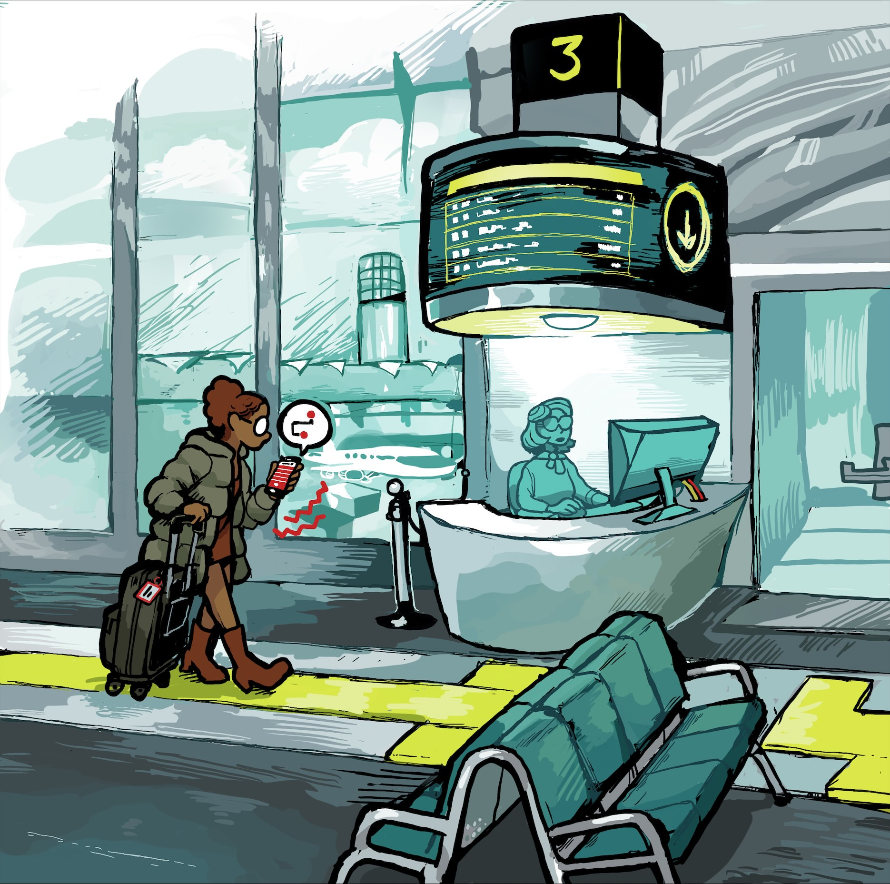

Bạn mở app du lịch lúc nửa đêm, thấy một tấm vé giá 499.000 đồng cho chuyến bay Sài Gòn – Đà Nẵng, bấm đặt ngay trước khi "chỗ hết". Đến màn hình thanh toán, con số ấy bỗng trở thành 1,2 triệu. Không phải app "sửa giá" — mà là hàng loạt khoản phí nhỏ đã được thả vào từng bước, đúng cái cách mà số tiền bạn phải trả cuối cùng khác xa con số bạn nghĩ mình đang trả. Với loại vé máy bay, nơi mà chuỗi mã **PNR** trên booking của bạn ghi lại toàn bộ hành trình và các dịch vụ kèm theo, câu chuyện "giá hiển thị so với giá thực trả" lại càng thú vị — và đôi khi, càng ít minh bạch.

*Ảnh: Wikimedia Commons — minh họa hành khách dùng ứng dụng tại sân bay (CC BY 4.0, Sherm for Disabled And Here).*

## Hiện tượng "phá giá ẩn" — drip pricing

Thuật ngữ kinh tế gọi đúng tên hiện tượng này là **drip pricing**: nhà bán hiển thị một mức giá khởi điểm thật bắt mắt, sau đó "nhỏ giọt" các khoản phí bắt buộc vào trong quá trình thanh toán — phí hành lý, phí chọn ghế, phí thanh toán, phí dịch vụ, thuế… tới tận màn hình cuối cùng mới lộ diện con số bạn thực sự phải trả. Các nghiên cứu về hành vi người tiêu dùng (chẳng hạn nhiều công bố trên các tạp chí khoa học kinh tế gần đây) chỉ ra một điểm chung: người mua có xu hướng so sánh giá dựa trên con số đầu tiên nhìn thấy, khiến giá "thấp giả" hút khách hơn hẳn giá "cao thật".

Trong ngành hàng không – đặc biệt với các hãng giá rẻ – đây là mô hình kinh doanh có chủ đích. Vé gốc được tách lìa khỏi mọi dịch vụ: bạn mua một "chỗ ngồi bay" thuần túy, còn hành lý, ăn uống, chọn ghế đều là các hạng mục cộng thêm. Thiết kế ấy không sai về bản chất — nó cho phép ai không kèm hành lý thì trả ít hơn — nhưng vấn đề nằm ở chỗ nhiều nền tảng cố tình trưng giá khởi điểm lên phía trước, để tới bước thanh toán hành khách mới "vỡ lẽ" tổng chi phí.

## Quy định mới nhất: cuộc chiến chống phí ẩn

Vì đây là vấn đề toàn cầu, các cơ quan quản lý bắt đầu mạnh tay. Gần đây nhất, **Bộ Giao thông vận tải Hoa Kỳ (DOT)** đã ban hành một quy định mang tên *Enhancing Transparency of Airline Ancillary Fees* — có hiệu lực từ tháng 4/2024 — yêu cầu các hãng hàng không và đại lý bán vé phải **hiển thị trước các khoản phí hành lý và phí đổi, hủy vé ngay trên màn hình đặt chỗ**, trước khi hành khách bấm chọn mua, thay vì giấu chúng ở bước cuối cùng. Với thị trường Mỹ, luật này quét phạm vi rất rộng ngay cả với hãng nước ngoài nếu họ bán vé có chặng bay đến hoặc đi từ Mỹ.

Liên minh châu Âu và nhiều nước khác cũng đang siết chặt kiểu quảng cáo "giá tố", đồng thời cơ quan bảo vệ người tiêu dùng như FTC (Mỹ) nhiều lần xử phạt các hãng bán vé vì phí "trượt vào" cuối chặng mua. Xu hướng chung của toàn thế giới: **giá hiển thị phải là giá gần đúng nhất với giá bạn thực trả**, và mọi phí bắt buộc không được "nhỏ giọt" về sau.

## Tại Việt Nam: những khoản phí hay gặp nhất

Ở các app đặt vé trong nước, phần lớn "cú sốc" đến từ ba nhóm phí giống nhau trên mọi hãng.

**Phí hành lý** là khoản chiếm vai trò lớn nhất với các hãng giá rẻ. Hầu hết hãng chia vé thành nhiều hạng: hạng rẻ nhất thường chỉ bao gồm 7kg hành lý xách tay, còn muốn ký gửi 20kg hay 30kg bạn phải mua thêm gói hành lý tương ứng với từng hạng vé (phổ biến là các bậc 20kg, 30kg, 40kg…). Một hành khách mua vé hạng rẻ nhất rồi phát sinh thêm kiện hành lý 20kg có thể phải trả thêm vài trăm nghìn đồng cho riêng khoản này — gần bằng chính giá vé lúc đầu. Hãng nào cũng công bố bảng giá hành lý công khai, nhưng vấn đề là con số đó không hề xuất hiện trong màn hình đầu tiên bạn so sánh giá.

**Phí đổi – hủy vé** là cú sốc thứ hai, và thường bất ngờ hơn. Vé hạng rẻ của không ít hãng giá rẻ thuộc diện *không hoàn, không đổi*, hoặc nếu đổi được thì mức phí bằng một phần đáng kể của vé mới. Với các hãng truyền thống, phí đổi vé tồn tại dưới dạng chênh lệch giá vé + phí dịch vụ, và con số cụ thể phụ thuộc hạng vé, thời điểm đổi và khoảng cách tới ngày bay. Thực tế phổ biến: vé càng "promo", điều kiện đổi hoàn càng khắt khe — một chi tiết thường được in chữ nhỏ mà ai tìm vé giá thấp cũng dễ bỏ qua.

**Phí thanh toán và phí dịch vụ** là lớp cuối cùng. Dù quy mô nhỏ hơn, nhưng vài chục nghìn đồng phí chuyển khoản/quẹt thẻ hoặc phí "dịch vụ" của đại lý online cũng đủ khiến bạn thấy khó hiểu khi so sánh tổng tiền thực trả với giá quảng cáo.

## Làm sao đặt vé "trong suốt"?

Tin tốt: không cần chờ luật, bạn hoàn toàn có thể tự mình nhìn xuyên qua những lớp phí ẩn chỉ bằng vài thao tác.

Trước khi so sánh giá giữa các hãng, hãy xác định chính xác nhu cầu của bạn: đi một mình hay cả gia đình, có hành lý ký gửi không, lịch trình có khả năng đổi không. Kế đó, đừng so sánh "giá vé trần" mà hãy so sánh **tổng chi phí** cho cùng một cấu hình nhu cầu: vé kèm 20kg, kèm quyền đổi. Nhiều app đã có sẵn công cụ lọc "bao gồm hành lý" — hãy bật nó lên. Cuối cùng, luôn đọc kỹ màn hình thanh toán: kiểm tra từng dòng phí trước khi bấm nút thanh toán, bởi luật lệ ở bất kỳ quốc gia nào cũng không thể bảo vệ bạn tốt bằng con mắt cẩn thận của chính bạn.

Một mẹo cuối: với các giao dịch đặt vé, hãy quay lại đối chiếu điều kiện đổi hoàn trong email xác nhận — thứ văn bản đi kèm đúng với chuỗi mã **PNR** mà chúng ta đã từng mổ xẻ trong [bài viết về PNR trên vé máy bay](/posts/pnr-la-gi-va-vi-sao-tren-ve-may-bay-luon-co-ma-6-ky-tu/). Cùng một booking reference, cùng những quyền lợi được in nhỏ, và cùng một bài học: trong hàng không, rẻ thường đắt, và minh bạch luôn phải xuất phát từ người mua.

Lần tới khi một tấm vé "499.000 đồng" ánh lên màn hình nửa đêm, hãy dành thêm vài giây — bởi con số thực sự bạn sẽ trả, nằm ở phía sau nút "thanh toán", chứ không phải phía trước ngón tay bạn đang định bấm.