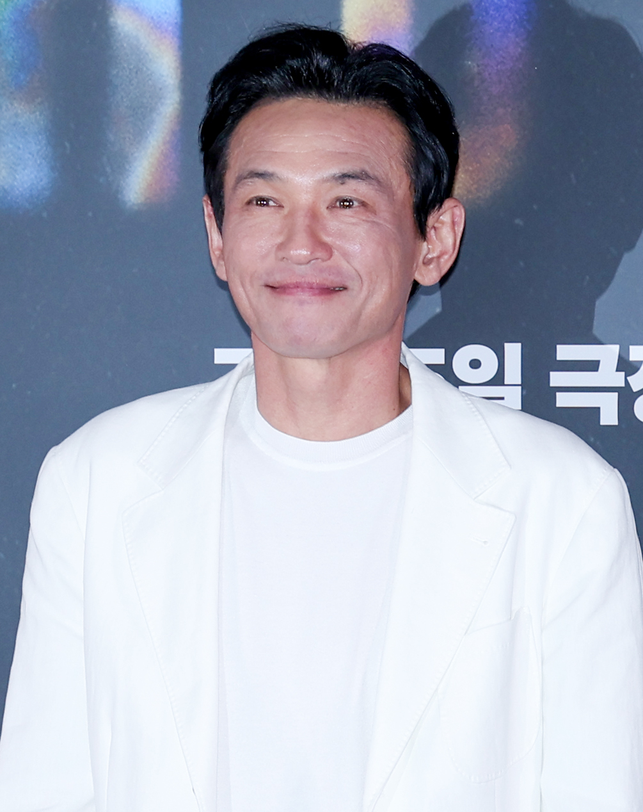

Ngày 29/7/2026, một bài đăng vạch trần đời tư diễn viên Hwang Jung-min (55 tuổi) bất ngờ lan truyền trên cộng đồng mạng Hàn Quốc. Kẻ lan truyền không phải một tờ báo lá cải mà là một phụ nữ 41 tuổi tự xưng có mối quan hệ "sâu sắc" với nam diễn viên huyền thoại của điện ảnh Hàn. Chưa đầy 24 giờ sau, công ty quản lý Sam Company phản pháo dữ dội: người phụ nữ này chính là **nghi phạm trong vụ án stalking** đã bị tòa án Hàn Quốc ra ba lệnh cấm tiếp xúc, và bị phạt 3 triệu won theo án lệnh tóm tắt. Tờ Dispatch — tờ báo giải trí nổi tiếng với những "bom tấn" độc quyền — đã vào cuộc và công bố toàn bộ bằng chứng. Vụ việc nhanh chóng trở thành cuộc chiến căng thẳng giữa hai câu chuyện đối lập: một bên là "nạn nhân của kẻ cuồng tín", một bên là "người bị lạm dụng tình cảm lâu năm".

*Ảnh: Wikimedia Commons — Hwang Jung-min, tháng 7/2026 (CC BY-SA 4.0).*

## Ba cuộc gặp và 5 giờ 30 phút của toàn bộ "mối quan hệ"

Theo điều tra của Dispatch công bố ngày 30/7, tổng cộng Hwang Jung-min và A (41 tuổi) chỉ gặp mặt **ba lần**: ngày 16/8/2023 (3 tiếng), 11/9/2023 (2 tiếng, tại khu ăn uống sân bay Incheon trước chuyến bay của nam diễn viên sang Romania) và 14/3/2024 (30 phút, tại một quán cà phê gần nhà hát Hakjeon Blue, thủ đô Seoul). Cả ba cuộc gặp cộng lại **5 giờ 30 phút**. Dispatch nhấn mạnh: giữa hai người không hề có quan hệ thể xác, không nắm tay, không khoác tay, không hôn hay bất kỳ hình thức thân mật nào.

Câu hỏi đặt ra là giữa họ có mối quan hệ gì. A không thể trả lời dứt khoát khi được hỏi cô là người hâm mộ, bạn bè, đồng nghiệp hay người yêu của Hwang Jung-min. Thay vào đó cô dùng một từ: **"quan hệ hai chiều" (쌍방관계)**. A khẳng định cô và nam diễn viên đã duy trì mối qua lại cá nhân suốt hai năm, và việc toàn bộ tương tác bị phủ nhận khiến cô thấy uất ức.

## Khởi nguồn: một lời hứa "lát ăn cơm" với fan cuồng

A từng là fan nhiệt thành của Hwang Jung-min, theo dõi anh trong mọi buổi giao lưu, thậm chí đến cả buổi chiếu ra mắt phim *The Guardian* (정우성 làm đạo diễn) chỉ vì biết nam diễn viên sẽ tới. Trớ trêu thay, chính Hwang Jung-min là người mở đầu mối liên hệ: anh nhớ mặt nhóm fan trong đó có A, nói lời cảm ơn và gửi số điện thoại bằng câu "sau này ăn một bữa cơm nhé". Ngày 16/8/2023, lời hứa đó thành hiện thực. Ngay đêm trước buổi gặp, cuộc nhắn tin giữa hai người đã có giọng điệu thân mật đậm chất "hẹn hò" — Hwang Jung-min nói đùa: *"Hẹn đầu tiên thì phải đưa về tận nhà chứ nhỉ, chẳng lẽ ăn mày à ㅎㅎㅎ"*, rồi *"Mai gặp nhé, háo hức quá đi thôi"*. Tại buổi gặp, nam diễn viên dành ba tiếng kể chuyện đời tư, một chi tiết mà A dùng làm bằng chứng cho "quan hệ hai chiều": cô hỏi ngược lại rằng — có diễn viên nào kể chuyện riêng tư cho fan không?

## Cú chốt "trồng cây" biến thành mầm mống bi kịch: vụ rượu soju

Ngày 11/9/2023, giữa khu food court sân bay Incheon, Hwang Jung-min vừa nhâm nhi ly soju vừa nói về một đề nghị kinh doanh: một thương hiệu rượu soju đang rủ anh tham gia, và anh hỏi A — vốn tốt nghiệp ngành thiết kế thị giác — có muốn thiết kế nhãn chai không. Với Hwang Jung-min, đây chỉ là kiểu "phá băng" trò chuyện. Với A, đây lại là công việc thật. Trong lúc anh sang Romania, cô tự tay nghiên cứu thị trường soju, tìm hiểu thủ tục đăng ký thương hiệu, say sưa chờ đợi phản hồi và hy vọng được gặp lại để bàn chuyện làm ăn. Câu trả lời cuối cùng của nam diễn viên là: *"Em quyết định không làm vụ soju nữa."* Chính lời đề nghị tưởng như vô hại này được Dispatch nhận định là **"khởi đầu của bi kịch"** — gieo cho A một ảo tưởng về mối quan hệ thân thiết không bao giờ tồn tại.

## Từ "đừng liên lạc nữa" đến cú sốc tự sát

Thấy A tiến tới quá khích, quá tạo áp lực, Hwang Jung-min bắt đầu xa dần. Ngày 7/12/2023, anh tuyên bố dứt khoát qua điện thoại: *"Thời gian tới đừng liên lạc nữa."* A nghe xong thì suy sụp. Cô kể lại với Dispatch rằng mình rơi vào trạng thái tự giam mình trong nhà suốt 40 ngày và **cố tìm đến cái chết**, sau đó được cha phát hiện và giúp hồi phục bằng việc tập luyện thể thao vào khoảng ngày 18/1. Cô nói: *"Lời nói của anh ấy qua điện thoại lúc đó quá sốc. Tôi rất yêu quý anh ấy. Bố đã nhìn thấy cảnh đó."*

## Khi "chặn rồi lại nhắn cho con trai anh"

Tình huống càng leo thang vào tháng 2/2024. Ngày 9/2, Hwang Jung-min đổi số điện thoại vì đánh giá sự đeo bám của A đã nặng nề hơn; hôm sau, anh chặn KakaoTalk. Nhưng biện pháp cắt liên lạc lại không chữa được bệnh, trái lại càng kích thích A. A đã làm điều được Dispatch mô tả là **"tội stalking lần một"**: nhắn tin trực tiếp cho **con trai của Hwang Jung-min**, khi đó còn vị thành niên, qua KakaoTalk — nội dung đại loại: *"Tôi không ngờ phải nhắn tin vì chuyện như thế này, nhưng bố anh đã làm sai với tôi rồi còn xui tôi tự tử. Nếu không muốn thành báo thì mau bỏ chặn và liên hệ tôi."*

Hwang Jung-min nhận được thông báo từ con, sợ hãi và lập tức bỏ chặn. Việc bỏ chặn như mở cửa xả lũ. Chỉ riêng ngày 10/2, A nhắn **78 tin, tổng cộng 6.119 ký tự** từ 11h05 sáng đến 21h04 tối, gồm những dòng thấm đẫm tuyệt vọng và trách móc: *"Anh có biết bệnh tâm thần là gì không? Anh bảo tôi đi chữa lành, tôi đã nhìn thấy chút hy vọng... Vậy mà khi tôi vừa đứng dậy được thì anh bảo cắt liên lạc và chúc hạnh phúc. Người ta dồn tôi đến bờ vực thẳm rồi còn khoác thêm một cú nữa."*

## 113 tin nhắn, ảnh xác mèo và tấm khiên "hai chiều"

Cơn cuồng phong lên đỉnh điểm tháng 5/2025. Trong bốn ngày 4, 5, 13, 14/5, A phát đi **113 tin nhắn với 4.902 ký tự** — kiểu "ném bom tin nhắn". Có những dòng nguyền rủa lặp đi lặp lại *"chết đi chết đi chết đi"*, có lời mỉa mai *"dân hèn trèo lên đầu người cao quý"*; xen lẫn là lời cầu xin *"xin hãy chỉ một lần thừa nhận tôi"* và nỗi đau *"tôi chẳng ghê tởm, chẳng quá đáng, tôi chỉ muốn được yêu thương thôi"*. Cùng thời điểm, Hwang Jung-min nhận được những thứ kinh khủng hơn nhiều: **ảnh xác con mèo chết, giấy ăn dính máu**, cùng những lá thư và **bản di chúc (tự sát)**. A còn nhắn những lời đe dọa gián tiếp như *"bảo anh ấy cứ chết đi cho anh ấy thoải mái"*.

Tòa án đã ghi nhận: tổng cộng A gửi Hwang Jung-min **11.021 ký tự KakaoTalk cùng 518 tin nhắn** trong một giai đoạn (theo cáo buộc của cơ quan công tố), riêng năm 2025 trong hai ngày liên tiếp có **275 tin nhắn báo tự sát**. Cô còn được cho là lẻn dự buổi diễn văn nghệ trong trường của con trai nam diễn viên rồi gửi ảnh vé để tạo áp lực, và ngày 31/7/2025 — sau lần nhắn tháng 2/2024 — lại tiếp tục liên lạc với con trai, kèm hai file ghi chép về mối quan hệ.

A phản bác lại toàn bộ bằng xây dựng một "khung sườn câu chuyện" khác: đây không phải sự đeo bám đơn phương mà là mối quan hệ qua lại, kiểu "yêu, giận, làm hòa, dứt áo" như người yêu. A khẳng định cô từng để trạng thái của mình lên ảnh đại diện KakaoTalk và Hwang Jung-min "ngày nào cũng xem", rằng nam diễn viên đã đọc và nhận xét các sáng tác văn chương cô đăng trên blog riêng. Với Dispatch, cô thậm chí đã xây dựng một hệ luận đầy mỉa mai: *"Quan hệ chúng tôi có thể là hai chiều, nhưng người ra tay trước là Hwang Jung-min. Cũng như luật sư Han Mun-cheol tuyên bố tỷ lệ 80:20 vậy."* Cô lập luận rằng việc Hwang Jung-min đổi số, bỏ chặn rồi chủ động gọi lại nhiều lần chính là bằng chứng cô không bị một chiều cắt đứt.

## Phía "ông lớn điện ảnh" phản ứng: vừa lạnh lùng vừa kiên định

Hwang Jung-min giữ thái độ im lặng gần như tuyệt đối. Sam Company khẳng định khởi tố hình sự đã nộp từ tháng 8/2025, tòa án đã ba lần ban lệnh cấm tiếp xúc, và án lệnh tóm tắt 3 triệu won đã được tuyên — sau đó A yêu cầu xét xử chính thức vì cho rằng mình vô tội. Ngày 11/8/2026, tại Tòa án Uijeongbu (chi nhánh Goyang), cơ quan công tố đã yêu cầu mức phạt nâng lên **10 triệu won** kèm lệnh tham gia chương trình điều trị chống stalking. A phủ nhận hoàn toàn, cho rằng mình không hề gửi tin nhắn để "gây sợ hãi" mà chỉ để bày tỏ tình trạng và giải quyết quan hệ. Phiên tuyên án dự kiến vào **ngày 8/9/2026** — chỉ vài ngày sau bài viết này.

Cùng đường ray pháp lý còn có vụ kiện dân sự: A đã khởi kiện Hwang Jung-min đòi bồi thường **200 triệu won** (khoảng 145.000 USD), với lý do cô không được trả công cho việc thiết kế nhãn rượu soju, viết kịch bản hay những ý tưởng sáng tạo khác vì lời đề nghị làm ăn của nam diễn viên. Ngày 14/8/2026, Tòa án Trung tâm Seoul chốt vụ hòa giải bằng **phán quyết hòa giải bắt buộc** trên cơ sở hai bên không đạt được thỏa thuận chủ động; phía Hwang Jung-min trước đó đã tuyên bố không có ý định hòa giải và không tham dự đối chất. Trong khi đó, phía đoàn làm phim *Hope* — bộ phim của đạo diễn Na Hong-jin do Hwang đóng chính — tố cáo A gửi email "dàn dựng ác ý" tới các đối tác, thậm chí làm phiền doanh nghiệp phân phối Mỹ Neon, và hai công ty Plus M Entertainment, Forged Films đã tuyên bố sẽ truy cứu trách nhiệm pháp lý vì cản trở hoạt động kinh doanh.

## Giữa "vạch trần" và "nạn nhân": vì sao dư luận Hàn lúng túng?

Vụ án này khiến dư luận Hàn Quốc phân cực mạnh. Một phía thấy hình ảnh rõ ràng của kẻ bám đuôi khủng khiếp: một người phụ nữ theo dõi thần tượng nhiều năm, đổ tiền công sức, rồi khi bị đẩy ra đã dùng chính mạng sống của mình làm vũ khí, gửi ảnh xác mèo, đe dọa tự sát và nhắn cho con trai chưa thành niên của người nổi tiếng. Phía đối lập thì nhìn thấy một "bài học quyền lực không đối xứng": diễn viên tầm cỡ nắm giữ hoàn toàn đòn bẩy trong mối quan hệ, gieo hy vọng bằng những câu chuyện riêng tư và lời đề nghị kinh doanh, rồi cắt liên lạc một cách thô bạo mà không hề dự liệu hậu quả về tâm lý.

Điều lúng túng nhất nằm ở chỗ: cả hai câu chuyện đều có thể cùng đúng. Hàn Quốc đã ban hành *Đạo luật trừng phạt tội phạm theo dõi (Stalking Punishment Act)* từ năm 2021, định nghĩa stalking là hành vi tiếp cận hoặc liên lạc lặp đi lặp lại trái với nguyện vọng của đối phương, không có lý do chính đáng — có thể bị xử phạt tới 3 năm tù hoặc 30 triệu won tiền phạt. Đạo luật này được soạn văn bản dựa trên triết lý: ranh giới được xác định bởi mong muốn của **nạn nhân**, không phải của người gửi tin nhắn. Luật sư đường lối của Dispatch nhấn mạnh một điểm xương sống: *việc "kẻ gây rối" kể chuyện của họ không biến hành vi của họ thành chính đáng; mọi ảo tưởng đều có thể tồn tại, nhưng hành động mà ảo tưởng đó dẫn đến thì vẫn là tội phạm lựa chọn có chủ đích.* Quan điểm đối lập ở quốc hội và giới luật gia lại đặt câu hỏi: khi hung thủ khởi xướng sự thân thiết bằng lời đề nghị kinh doanh, liệu dòng tin nhắn "liều" nào mới đáng bị truy tố — kẻ gửi hay người đã gieo tiếng vọng?

## Bài học từ một vụ án "hai chiều" chưa có hồi kết

Đến nay, tám ngày sau khi Dispatch bắt đầu công bố loạt bài độc quyền (30/7–1/8/2026), câu trả lời cuối cùng vẫn thuộc về tòa án. A đã làm những việc rất dễ bị xã hội giễu cợt — nhưng bên dưới sự lố bịch ấy là một cơn khốn cùng thật sự: mất việc, tự cô lập, nhiều lần tìm đến cái chết. Cô nói với Dispatch rằng suốt hai năm cô "bị lôi kéo", rằng cô chỉ muốn một lần được ôm, một lần được thừa nhận sự tồn tại của mình. Và người đàn ông cô đeo bám — dù có lỗi trong cách giữ khoảng cách, trong câu "tối mai háo hức quá" vô nghĩa kia — thì vẫn chỉ muốn một điều: để gia đình yên ổn.

Trong vũ điệu căng thẳng giữa "kẻ quấy rối" và "kẻ chối bỏ", điều rõ ràng nhất có lẽ không nằm ở bản án sẽ được tuyên ngày 8/9. Nó nằm ở một ranh giới mà ai cũng cần nhớ: một lời đề nghị quá đà, một cuộc trò chuyện riêng tư với người không cùng đẳng cấp quyền lực, hay nụ cười thân thiện với fan — tất cả đều có thể được đọc như lời mời gọi. Và một khi người nhận đã đọc như vậy, việc "cố gắng giải thích" qua hàng loạt tin nhắn tuyệt vọng sẽ không bao giờ được một tòa án lắng nghe như lời yêu thương.



