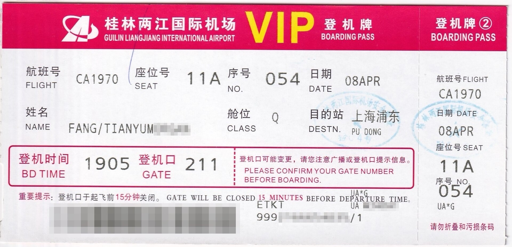

Nếu đã từng đặt vé máy bay, chắc hẳn bạn bắt gặp một chuỗi mã 6 ký tự ở khắp nơi: trong email xác nhận đặt chỗ, trên tờ biên nhận, ngay trên thẻ lên máy bay, thậm chí được in lên cả bag tag của hành lý. Nó "theo chân" bạn từ lúc đặt vé cho đến khi chuyến đi khép lại — vầng mã tưởng như vô thưởng vô phạt ấy được gọi là **booking reference** hay **record locator**, và nó chính là chiếc chìa khóa mở ra một hồ sơ mà ngành hàng không và an ninh quốc gia đều quan tâm: **Passenger Name Record (PNR)**. Vậy PNR thực chất là gì, dùng để làm gì, và tại sao nó vừa cần thiết lại vừa gây tranh cãi?

*Ảnh: Wikimedia Commons — vé lên máy bay phát hành tại sân bay Guilin, Trung Quốc (CC BY-SA 4.0).*

## PNR là hồ sơ "phiên bản ảo" của chính bạn

Bạn không thể lên máy bay nếu không có PNR — bởi với hãng hàng không, Passenger Name Record chính là *phiên bản số của bạn*. Đó là một file dữ liệu lưu mọi thứ bạn khai báo lúc đặt vé: tên, ngày đi, hành trình bay, thông tin liên lạc, số ghế, và đôi khi nhiều thông tin hơn thế. Hành khách hiếm khi thấy trực tiếp file PNR của mình, nhưng họ liên tục làm việc với chiếc "chìa khóa" của nó — chính là chuỗi mã 6 ký tự kia.

PNR phục vụ **hai mục đích chính**. Mục đích thứ nhất thuần túy vận hành: cho phép hãng bay, đại lý du lịch và nhân viên phục vụ sân bay truy cập nhanh thông tin liên quan đến chuyến đặt của bạn, đồng thời chia sẻ dữ liệu này với các hãng khác — chẳng hạn khi bạn đi chuyến nối chuyến hoặc di chuyển kết hợp máy bay – đường sắt. Nhờ đó một người di chuyển bằng chuỗi hành trình phức tạp vẫn đến nơi an toàn, không ai trong đoàn bị lạc hay bị bỏ quên. Mục đích thứ hai thì kịch tính hơn: **dữ liệu PNR được dùng để ngăn chặn tội phạm**. Các cơ quan thực thi pháp luật đã dùng PNR suốt nhiều thập kỷ để lần ra khủng bố, tội phạm, kẻ buôn người và ma túy. Một ví dụ điển hình: chính dữ liệu PNR đóng vai trò quan trọng trong vụ bắt giữ những kẻ chủ mưu vụ tấn công Mumbai năm 2008. Trước bối cảnh hàng loạt vụ tấn công khủng bố, các cơ quan an ninh không ngừng tìm công cụ để "tách người tốt khỏi kẻ xấu" trước khi chúng lên máy bay.

## Ba lớp dữ liệu bên trong một file PNR

Để hiểu PNR "biết" những gì về bạn, hãy theo dõi một hành khách điển hình bắt đầu từ lúc đặt chỗ — qua đại lý hoặc tự đặt trên Expedia. Dù chọn cách nào, hành khách cũng buộc phải để lại một số thông tin cá nhân, và những thông tin này nằm trong ba lớp khác nhau.

**Lớp thứ nhất — dữ liệu bắt buộc**, không có thì không thể hoàn tất đặt chỗ: số điện thoại của bạn hoặc của đại lý du lịch như phương thức liên lạc chính; lịch trình hành trình (route và lịch bay đầy đủ); tên bạn và tên của từng người trong đoàn đi cùng; dữ liệu xuất vé cho biết vé sẽ được phát hành theo hình thức nào; và thông tin tham chiếu — ghi lại người cuối cùng chỉnh sửa PNR, có thể là đại lý du lịch hoặc nhân viên hãng bay.

**Lớp thứ hai — dữ liệu tùy chọn**, do nhu cầu thương mại của từng hãng quyết định. Phạm vi có thể từ phương thức thanh toán và số thẻ tín dụng, đến địa chỉ email, độ tuổi, sở thích ăn uống và chỗ ngồi, số thẻ hành khách thường xuyên (frequent flyer), và nhiều thứ khác. Vì bị bỏ mặc cho từng hãng hàng không quyết định nên file PNR có thể "nặng" hơn nhiều so với tưởng tượng của hành khách.

**Lớp thứ ba — dữ liệu hành khách Secure Flight (SFPD)**, và lớp này không do hãng bay quyết định. SFPD được gửi đến Cơ quan An ninh Vận tải Mỹ (TSA) 72 giờ trước chuyến bay để TSA quyết định hành khách nào cần được kiểm tra kỹ hơn người khác. SFPD gồm: tên đầy đủ đúng như trên giấy tờ tùy thân, ngày sinh, giới tính, và một thứ gọi là *redress number* — số bảo vệ dành cho hành khách trùng tên với ai đó trong danh sách theo dõi của TSA, giúp họ tránh bị soi chiếu phiền hà. Ba lớp dữ liệu này cộng lại tạo thành một file PNR hoàn chỉnh.

## Mã 6 ký tự được "sinh ra" như thế nào?

PNR được tạo ra trong một **CRS — Computer Reservation System**, phần mềm các hãng hàng không dùng để lưu kho hàng (inventory) và ghi nhận giao dịch. Nếu vé được đặt trực tiếp trên website hãng, PNR sẽ được sinh trong CRS của chính hãng. Nhưng nếu đặt qua đại lý du lịch hoặc website đặt vé online, PNR được tạo trên **GDS — Global Distribution System** như Sabre hay Amadeus. Thông thường các hãng lưu kho hàng ngay trên GDS nên mọi thứ diễn ra luôn ở đó. Với đại lý du lịch, nhân viên thường nhập chi tiết hành khách bằng tay; còn với OTA (đại lý online), mọi thứ được tự động hóa hoàn toàn.

Record locator cũng được hệ thống sinh ra tự động. Booking reference thường là chuỗi 6 ký tự gồm chữ và số, nhìn có vẻ ngẫu nhiên nhưng thực tế được tạo bằng thuật toán để tránh những tổ hợp rắc rối: một số hệ thống loại bỏ các ký tự dễ gây nhầm lẫn trong một số font — như số 0 và chữ O, số 1 và chữ I, hay số 8 và chữ B. Các record locator cũng thường được so sánh với danh sách các từ tục tĩu để tránh vô tình tạo ra tổ hợp phản cảm — dù những trùng hợp khôi hài vẫn thỉnh thoảng xảy ra.

Vậy khi bạn bay nối chuyến giữa các hãng khác nhau, dùng các hệ thống đặt chỗ khác nhau thì sao? Khi đó một **super PNR** được tạo ra. Hãy tưởng tượng một hành khách lên kế hoạch bay từ New York đến Ubud, phải đổi máy bay hai lần — một lần ở Rome, một lần ở Delhi. Hãng đầu tiên khai thác chặng New York – Rome sẽ tạo một hành trình mẹ (master itinerary) với super PNR, rồi gửi bản sao cho các hãng còn lại trên hành trình. Hai hãng phục vụ chặng Rome – Delhi và Delhi – Ubud sẽ xác nhận phần chặng của mình và cập nhật hành trình mẹ bằng record locator riêng của họ. Nhờ vậy hãng đầu tiên nắm super PNR kết nối mọi mã PNR dưới một booking reference duy nhất, đảm bảo các cập nhật được trao đổi đúng chuỗi. Hành khách chỉ nhận về một PNR chính duy nhất trong email xác nhận đặt chỗ.

## Sau khi chuyến bay kết thúc: PNR còn sống hay đã "chết"?

PNR không chỉ là mã nhận diện — nó là tập hợp dữ liệu, và dữ liệu thì nhạy cảm. Ít ai phản đối việc phải khai tên và email cho hãng bay để đến nơi an toàn, nhưng chuyện gì xảy ra với những dữ liệu thường được bảo vệ gắt gao hơn trong các bối cảnh khác? Cả Mỹ lẫn Liên minh châu Âu đều có quy định riêng về việc dùng và xóa dữ liệu PNR.

Theo các quy định này, cơ quan an ninh được phép lưu giữ dữ liệu PNR trong **5 năm**, và dữ liệu phải được **phi danh tính hóa (depersonalized) trong 6 tháng** kể từ khi nhận. Mỗi quốc gia tham gia chương trình đều phải có hệ thống xử lý và bảo vệ dữ liệu, đồng thời có một cán bộ bảo vệ dữ liệu (Data Protection Officer) chịu trách nhiệm. Thậm chí sau 5 năm, dữ liệu cũng không bị xóa sạch hoàn toàn khỏi hệ thống — nó chỉ được lưu trữ (archive) và vẫn có thể truy cập để phục vụ ứng phó an ninh trong 10 năm tiếp theo.

Tin tốt là các hãng hàng không **không được bán hay chia sẻ dữ liệu PNR cho mục đích thương mại**. Họ thậm chí không được dùng dữ liệu này cho chính mình, chẳng hạn phân khúc khách hàng (customer segmentation) hay định giá động (dynamic pricing). Đặt vấn đề ngược lại: liệu người bình thường có thực sự e ngại nhiều khi mở một chiếc thẻ thành viên (club card) của đại siêu thị — nơi họ cung cấp lượng thông tin gấp **bốn lần** như vậy mà không có nhiều cơ chế bảo vệ như PNR?

Dĩ nhiên, có quy định không có nghĩa là cơ sở dữ liệu PNR không thể bị tội phạm tấn công, hoặc bị các tổ chức thương mại lợi dụng — như từng xảy ra trong vụ bê bối Facebook–Cambridge Analytica. Những lo ngại này che phủ tương lai của PNR và cách nó được xử lý trong thời gian tới.

## Những ngày cuối của PNR?

Ngành du lịch đang trải qua những thay đổi lớn về khả năng kết nối dữ liệu, và PNR nhiều khả năng cũng biến đổi theo. IATA đang nỗ lực thúc đẩy chương trình **NDC (New Distribution Capability)**, trong đó có **ONE Order** — một nền tảng quản lý offer và order nhằm tạo một định danh duy nhất cho mọi sản phẩm, dịch vụ hành khách đã đặt. Điều này nghĩa là các loại hồ sơ như e-ticket (chứa thông tin thanh toán), EMD (chứa các dịch vụ mua thêm) và PNR (chứa chi tiết hành trình) sẽ được gói gọn dưới một order ID. Việc "nói lời chia tay" với PNR sẽ không diễn ra trong một sớm một chiều — quá trình chuyển đổi được đánh giá là chậm và dần dần. Nhưng hệ thống mới hứa hẹn giúp hãng bay và đại lý quản lý tài liệu dễ dàng hơn, và một ngày nào đó, nó có thể đánh dấu **sự kết thúc của PNR như chúng ta từng biết**.

Lần tới khi chuỗi 6 ký tự xuất hiện trong email xác nhận của bạn, hãy nhớ: đó không chỉ là một cái "mã để check-in". Đằng sau nó là một hồ sơ đang được nhiều bên cùng dùng — để đưa bạn về đúng nhà ga, nhưng cũng để cảnh sát và an ninh biết ai đang ngồi ở hàng ghế nào trên bầu trời. Nó phản ánh đúng nghịch lý của ngành hàng không hiện đại: càng dễ bay, hệ thống càng phải biết nhiều về bạn.



